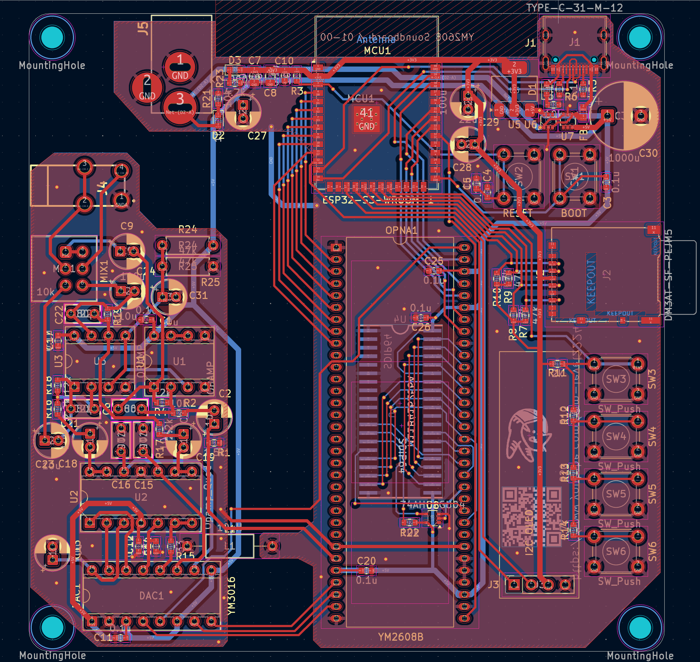

# source-92
OPNA Sound Board

This system plays VGM files using the YM2608B sound chip. It is particularly well-suited for playing VGM data from the NEC PC-9801 and PC-8801 series. I have written the source code for the ESP32-S3; while there are likely still many bugs, it is currently in a working state.

Please watch the video for details: https://youtu.be/8tprrlNsprk

# License
The source code is licensed MIT. The website content is licensed CC BY 4.0,see LICENSE.
